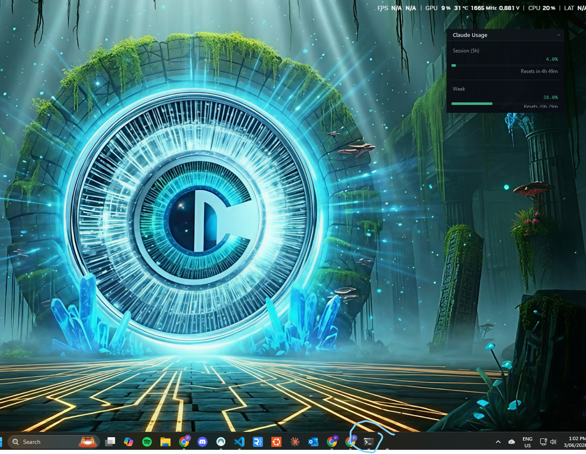
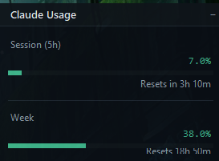

# Claude Usage Widget for Windows

A lightweight floating desktop widget that shows your Claude.ai session (5h) and weekly usage limits in real time — colour-coded, always visible, never in the way.

---

## What you get

- **Live progress bars** for your 5-hour session limit and weekly limit
- **Countdown timers** — know exactly when your limit resets
- **Colour-coded** green → orange → red as you approach the cap
- **System tray icon** that mirrors the current usage colour
- **4 themes** — Default (dark), Neon, Light, Minimal
- **Single-instance guard** — launching twice does nothing
- Remembers window position across restarts

---

## Requirements

- Windows 10 or 11
- Python 3.10 or later — [download here](https://www.python.org/downloads/)
  - During install, tick **"Add Python to PATH"**

---

## Setup (one time, ~30 seconds)

1. **Download** this repo — click the green `Code` button → `Download ZIP`, then extract it anywhere
2. **Run `setup.bat`** — installs the two required Python packages and creates a desktop shortcut
3. **Double-click "Claude Usage Widget"** on your desktop to launch

On first launch you'll be prompted to paste your Claude session key (see below).

> **After setup:** just use the desktop shortcut (or `launch.bat`) to start the widget. You don't need to run `setup.bat` again.

> If you prefer the command line: `git clone https://github.com/WorkFlowAutomationNetwork/claude-usage-widget-windows---public.git` then run `setup.bat`.

---

## Getting your session key

The widget reads from Claude's internal usage API using your browser session cookie.

1. Open [claude.ai](https://claude.ai) in Chrome and log in
2. Press **F12** → **Application** tab → **Cookies** → `https://claude.ai`
3. Find the cookie named **`sessionKey`** and copy its value
4. Paste it into the widget when prompted (or later via Tray → Set session key…)

Your key is stored locally at `~/.claude/claude-usage-widget.json` and never sent anywhere other than Claude's own API.

---

## Daily use

Double-click the desktop shortcut to start. The widget appears in the top-left corner of your screen.

A coloured dot also appears in your **system tray** — that's the small area in the bottom-right corner of your taskbar near the clock. If you don't see it, click the **^** (up arrow) to reveal hidden icons.

**Right-click the tray dot** to access:

| Option | What it does |
|--------|-------------|
| Show / Hide | Toggle the floating widget on/off |
| Refresh now | Force an immediate data fetch |
| Theme | Switch between the 4 built-in themes |
| Set session key… | Update your Claude session key |
| Quit | Exit cleanly |

Usage data refreshes automatically every 5 minutes.

---

## Themes

Switch anytime via Tray → Theme. Four options included:

| Theme | Description |
|-------|-------------|
| **Default** | Dark background, green/amber/red bars — easy on the eyes |
| **Neon** | Deep dark with vibrant neon colours |
| **Light** | White background for bright environments |
| **Minimal** | Compact, low-contrast, stays out of the way |

---

## Auto-start with Windows

To have the widget start automatically when you log in:

1. Press **Win + R**, type `shell:startup`, press Enter
2. Copy the **"Claude Usage Widget"** shortcut from your desktop into the folder that opens

---

## Troubleshooting

**Widget doesn't appear after launching**
The window may be off-screen from a previous session. The app auto-corrects this on startup — if it still doesn't appear, check the system tray and use Show / Hide.

**"No session key" error in the widget**
Use Tray → Set session key… to enter or update your key.

**Multiple tray icons**
Hover over each one — Windows removes stale icons on hover. The single-instance guard prevents this from recurring.

**`pip install` failed during setup**
Make sure Python is installed and "Add Python to PATH" was ticked. You can verify with: open Command Prompt and type `python --version`.

**Session key stopped working**
Claude session cookies expire periodically. Follow the steps above to grab a fresh one from your browser.

---

## License

MIT — free to use, modify, and share. See [LICENSE](LICENSE).
